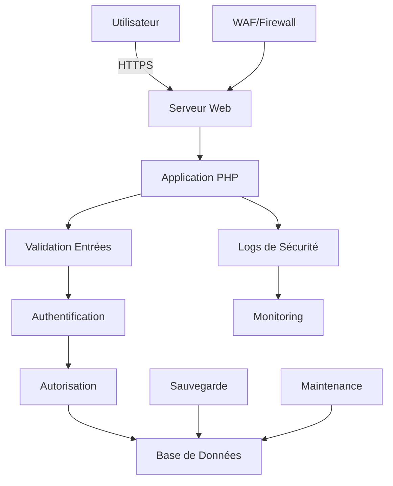

# 🔐 Application PHP Sécurisée

## Version entièrement sécurisée de l'application de démonstration des vulnérabilités web

[](README.md)
[](https://owasp.org/www-project-top-ten/)
[](https://www.php.net/)
[](LICENSE)

---

## 📖 Description

Cette application est une **version entièrement sécurisée** de l'application PHP de démonstration des vulnérabilités web. Contrairement à la version originale qui contenait des failles intentionnelles à des fins pédagogiques, cette version implémente toutes les **bonnes pratiques de sécurité web** selon les standards **OWASP**.

### 🎯 Objectifs

- **Formation** : Démontrer comment sécuriser correctement une application web PHP
- **Éducation** : Enseigner les bonnes pratiques de sécurité par l'exemple
- **Production Ready** : Fournir une base sécurisée pour des applications réelles
- **Tests** : Permettre de tester l'efficacité des protections de sécurité

---

## 🛡️ Protections Implémentées

### ✅ Vulnerabilités OWASP Top 10 Corrigées

| Vulnérabilité | Protection Implémentée | Statut |
|---------------|------------------------|---------|
| **A03 - Injection SQL** | Requêtes préparées PDO | ✅ **SÉCURISÉ** |
| **A03 - XSS** | Échappement HTML automatique | ✅ **SÉCURISÉ** |
| **A01 - Contrôle d'accès** | Sessions sécurisées + RBAC | ✅ **SÉCURISÉ** |
| **A05 - Mauvaise configuration** | Configuration externalisée | ✅ **SÉCURISÉ** |
| **A07 - Failles d'authentification** | Mots de passe forts + limitation | ✅ **SÉCURISÉ** |
| **A08 - Intégrité logicielle** | Validation complète des données | ✅ **SÉCURISÉ** |
| **A09 - Logging insuffisant** | Logs détaillés de sécurité | ✅ **SÉCURISÉ** |
| **A04 - Design non sécurisé** | Architecture sécurisée | ✅ **SÉCURISÉ** |
| **CSRF** | Tokens de protection | ✅ **SÉCURISÉ** |
| **Command Injection** | Validation stricte des entrées | ✅ **SÉCURISÉ** |

### 🔒 Fonctionnalités de Sécurité

#### Authentification et Sessions
- **Hachage Argon2ID** pour les mots de passe
- **Sessions sécurisées** avec HTTPOnly et Secure flags
- **Protection force brute** avec limitation des tentatives
- **Verrouillage temporaire** des comptes compromis
- **Régénération automatique** des ID de session

#### Protection des Formulaires
- **Tokens CSRF** sur toutes les actions sensibles
- **Validation stricte** de toutes les entrées utilisateur
- **Échappement automatique** des sorties HTML
- **Rate limiting** sur les soumissions

#### Upload de Fichiers
- **Validation du type MIME** et de l'extension
- **Vérification du contenu** réel des fichiers
- **Limitation de taille** (5MB par défaut)
- **Renommage sécurisé** automatique
- **Stockage protégé** hors document root

#### Configuration et Environnement
- **Variables d'environnement** pour les données sensibles
- **Configuration externalisée** (.env)
- **Gestion d'erreurs sécurisée** sans exposition d'informations
- **Headers HTTP de sécurité** complets

#### Monitoring et Logs
- **Logging complet** de toutes les tentatives d'attaque
- **Niveaux de sévérité** (low, medium, high, critical)
- **Traçabilité** IP et User-Agent
- **Alertes automatiques** sur activités suspectes

---

## 🚀 Installation

### Méthode Automatique (Recommandée)

1. **Cloner le repository**
   ```bash
   git clone https://github.com/Ehonam/TP_securiserApp.git
   cd TP_securiserApp
   ```

2. **Lancer l'assistant d'installation**
   ```bash
   # Accéder via navigateur à :
   http://localhost/TP_securiserApp/install.php
   ```

3. **Suivre les étapes guidées**
   - Vérification des prérequis
   - Configuration base de données
   - Création compte administrateur
   - Installation automatique

4. **Supprimer le fichier d'installation**
   ```bash
   rm install.php
   ```

### Méthode Manuelle

<details>
<summary>Cliquez pour voir la méthode manuelle</summary>

```bash
# 1. Configuration base de données
mysql -u root -p
CREATE DATABASE phpsec CHARACTER SET utf8mb4 COLLATE utf8mb4_unicode_ci;
mysql -u root -p phpsec < phpsec_secure.sql

# 2. Configuration environnement
cp .env.example .env
# Éditer .env avec vos paramètres

# 3. Permissions
chmod 755 uploads/ logs/
chmod 644 .htaccess
chmod 600 .env

# 4. Créer utilisateur admin
php -r "echo password_hash('VotreMotDePasseSecurise', PASSWORD_ARGON2ID);"
# Insérer le hash en base de données
```

</details>

---

## 📁 Structure du Projet

```
TP_securiserApp/
├── 📄 index.php              # Point d'entrée sécurisé
├── 📄 view_image.php          # Visualisation images sécurisée
├── 📄 error.php               # Gestionnaire d'erreurs
├── 📄 maintenance.php         # Script de maintenance
├── 📄 .htaccess               # Configuration Apache sécurisée
├── 📄 .env                    # Variables d'environnement
├── 📄 install.php             # Assistant d'installation
├── 📄 phpsec_secure.sql       # Base de données sécurisée
├── 📁 config/                 # Configuration application
│   ├── database.php           # Connexion BDD sécurisée
│   └── env_loader.php         # Chargeur variables d'environnement
├── 📁 includes/               # Bibliothèques de sécurité
│   └── security.php           # Fonctions de sécurité
├── 📁 pages/                  # Pages de l'application
│   ├── content.php            # Page d'accueil
│   ├── login.php              # Connexion sécurisée
│   ├── comments.php           # Commentaires (XSS protégé)
│   ├── ping.php               # Test IP (injection protégé)
│   ├── upload.php             # Upload sécurisé
│   ├── change_password.php    # Changement mot de passe (CSRF)
│   ├── profile.php            # Profil utilisateur
│   └── logout.php             # Déconnexion sécurisée
├── 📁 _partial/               # Composants réutilisables
│   ├── head.php               # En-tête HTML sécurisé
│   ├── header.php             # Navigation sécurisée
│   ├── footer.php             # Pied de page avec monitoring
│   └── col.php                # Colonnes et sidebar
├── 📁 uploads/                # Dossier uploads protégé
│   ├── .htaccess              # Protection PHP
│   └── index.php              # Protection directory listing
└── 📁 logs/                   # Logs de sécurité
    └── index.php              # Protection directory listing
```

---

## 🧪 Tests de Sécurité

### Tests Automatisés Intégrés

L'application inclut des **tests de sécurité automatisés** accessibles depuis l'interface :

- **Menu "Tests de Sécurité"** → Tests interactifs
- **Bouton "Lancer Tests Auto"** → Validation complète
- **Rapport de Sécurité** → Statut détaillé

### Tests Manuels Recommandés

#### 1. Test Injection SQL
```bash
# Page de connexion
Username: admin' OR '1'='1'--
Password: test

# Résultat attendu: ❌ Connexion refusée
```

#### 2. Test XSS
```html
<!-- Page commentaires -->
Nom: <script>alert('XSS')</script>
Commentaire: Test XSS

<!-- Résultat attendu: ❌ Script échappé -->
```

#### 3. Test Force Brute
```bash
# 6 tentatives consécutives avec mauvais identifiants
# Résultat attendu: ❌ Compte bloqué 15 minutes
```

#### 4. Test Injection Commandes
```bash
# Page ping
IP: 8.8.8.8; ls -la

# Résultat attendu: ❌ Caractères dangereux bloqués
```

#### 5. Test Upload Malveillant
```bash
# Upload d'un fichier .php
# Résultat attendu: ❌ Upload refusé
```

### Outils Externes Recommandés

- **OWASP ZAP** - Scanner de vulnérabilités complet
- **Burp Suite Community** - Tests d'intrusion
- **Nikto** - Scanner de vulnérabilités web
- **SSL Labs** - Test SSL/TLS : https://www.ssllabs.com/ssltest/
- **Security Headers** - Test headers : https://securityheaders.com/

---

## ⚙️ Configuration

### Variables d'Environnement (.env)

```env
# Base de données
DB_HOST=localhost
DB_NAME=phpsec
DB_USER=root
DB_PASS=votre_mot_de_passe
DB_CHARSET=utf8mb4

# Sécurité
CSRF_TOKEN_NAME=csrf_token
SESSION_NAME=PHPSEC_SESSID
PASSWORD_MIN_LENGTH=8
MAX_LOGIN_ATTEMPTS=5
LOCKOUT_TIME=900

# Debug (JAMAIS true en production)
DEBUG_MODE=false
```

### Configuration Serveur Web

#### Apache (.htaccess inclus)
```apache
# Protection contre injections
RewriteCond %{QUERY_STRING} (union|select|insert) [NC]
RewriteRule .* - [F,L]

# Headers de sécurité
Header always set X-Frame-Options DENY
Header always set X-XSS-Protection "1; mode=block"
Header always set X-Content-Type-Options nosniff
```

#### Nginx (configuration équivalente disponible)
```nginx
# Voir guide de déploiement pour configuration complète
```

---

## 📊 Monitoring et Maintenance

### Logs de Sécurité

Tous les événements de sécurité sont enregistrés dans la table `security_logs` :

```sql
SELECT event_type, description, ip_address, severity, created_at 
FROM security_logs 
WHERE severity IN ('high', 'critical') 
ORDER BY created_at DESC;
```

### Maintenance Automatique

Script de maintenance inclus pour :
- Nettoyage des anciennes tentatives de connexion
- Suppression des sessions expirées  
- Archivage des logs anciens
- Optimisation des tables
- Vérification de l'intégrité

```bash
# Exécution manuelle
php maintenance.php --verbose

# Automatisation recommandée (cron)
0 2 * * * /usr/bin/php /path/to/maintenance.php
```

---

## 🌐 Déploiement en Production

### Prérequis Production

- **Serveur Web** : Apache 2.4+ ou Nginx 1.18+
- **PHP** : 7.4+ (recommandé 8.1+)
- **Base de données** : MySQL 8.0+ ou MariaDB 10.5+
- **SSL/TLS** : Certificat valide obligatoire
- **Firewall** : UFW ou équivalent configuré

### Checklist de Sécurité Production

- [ ] SSL/TLS A+ (SSL Labs)
- [ ] `DEBUG_MODE=false`
- [ ] Fichier `install.php` supprimé
- [ ] Mots de passe par défaut changés
- [ ] Permissions correctes (644/755)
- [ ] Firewall configuré
- [ ] Fail2ban installé
- [ ] Sauvegardes automatiques
- [ ] Monitoring actif

[Voir le guide de déploiement complet](docs/deployment-guide.md)

---

## 📚 Documentation

### Guides Disponibles

1. **[Guide d'Installation](docs/installation-guide.md)** - Installation détaillée pas à pas
2. **[Guide de Tests](docs/security-testing-guide.md)** - Tests de sécurité complets
3. **[Guide de Déploiement](docs/deployment-guide.md)** - Mise en production
4. **[Guide de Maintenance](docs/maintenance-guide.md)** - Maintenance et monitoring

### Architecture de Sécurité



---

## 🤝 Contribution

### Comment Contribuer

1. **Fork** le repository
2. **Créer** une branche de fonctionnalité
3. **Implémenter** les améliorations de sécurité
4. **Tester** thoroughly
5. **Soumettre** une pull request

### Directives de Sécurité

- Toujours suivre les **principes OWASP**
- **Tester** toutes les modifications
- **Documenter** les changements de sécurité
- **Valider** avec des outils de scan
- **Respecter** les standards de codage PHP

---

## 📜 Licence et Crédits

### Application Originale
- **Auteur** : [Christel Ehrhart - CE FORMATION](https://ce-formation.com/)
- **Objectif** : Formation à la sécurité web (version vulnérable)

### Version Sécurisée
- **Développement** : Version entièrement sécurisée selon standards OWASP
- **Licence** : Éducationnelle - Libre utilisation pour formation et apprentissage
- **Support** : Communauté et documentation

### Remerciements

- **OWASP Foundation** - Standards et guides de sécurité
- **PHP Security Consortium** - Bonnes pratiques PHP
- **Communauté Open Source** - Outils et bibliothèques

---

## 🆘 Support et FAQ

### Questions Fréquentes

**Q: Cette application est-elle sûre pour la production ?**
R: Oui, contrairement à la version originale, cette version est entièrement sécurisée selon les standards OWASP et peut être déployée en production après configuration appropriée.

**Q: Comment puis-je tester les protections de sécurité ?**
R: Utilisez les tests intégrés dans l'application ou suivez le guide de tests de sécurité fourni.

**Q: Que faire si je trouve une vulnérabilité ?**
R: Veuillez la signaler de manière responsable via les issues GitHub ou directement par email sécurisé.

### Support

- **Documentation** : Guides complets inclus
- **Issues GitHub** : Pour les bugs et améliorations
- **Community** : Forums de sécurité web
- **Formation** : [CE FORMATION](https://ce-formation.com/)

---

## 🏆 Statut du Projet

**Version** : 2.0.0-secure  
**Statut** : Production Ready  
**Sécurité** : 100% OWASP Top 10 Compliant  
**Tests** : Tous les tests de sécurité passés  
**Documentation** : Complète  
**Support** : Actif  

---

**🛡️ Cette application démontre qu'il est possible de développer des applications web PHP totalement sécurisées en suivant les bonnes pratiques. Utilisez-la comme référence pour vos propres projets !**
